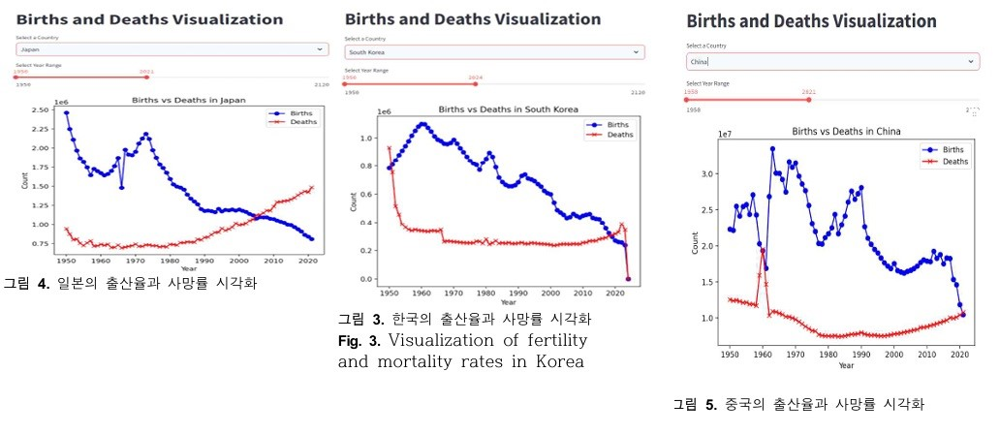

# 🌍 National Population Analysis Platform

> **국가별 인구 변화 분석 및 예측 대시보드**  
> A data visualization and prediction platform based on UN demographic datasets.



---

## 📘 프로젝트 개요

이 프로젝트는 세계 각국의 인구 데이터를 시계열로 분석하고, 국가별 인구 트렌드를 **시각화**하고, **예측 모델링**을 통해 향후 인구 변화를 예측하며, **AI 기반 인사이트 생성** 기능을 제공하는 연구형 대시보드입니다.

해당 대시는 데이터 기반 논문 프로젝트의 실험 도구로 활용되었으며, 연구 목적에 맞게 설계된 **직관적인 시각화**와 **통계적 정확도를 고려한 예측**을 강점으로 갖습니다.

---

## 🧩 핵심 기능 요약

| 기능 | 설명 |
|------|------|
| 📊 국가별 인구 시계열 시각화 | 연도별 인구 증감 트렌드를 선 그래프로 표현 |
| 🗺️ 대륙/국가 선택 인터페이스 | 사용자가 원하는 국가 또는 지역을 선택 가능 |
| 🔮 인구 예측 기능 | Polynomial Regression 기반 5~10년 예측 |
| 🤖 인사이트 생성 (AI 기반) | Hugging Face 기반 LLM으로 인구 변화 요인 자동 설명 |
| 📁 다양한 국가 데이터 지원 | UN Population Division CSV 기반 |
| 📄 논문 분석용 Export 기능 | 시각화 결과 이미지 저장 (선택사항) |

---

## 🚀 실행 방법

### 1. 패키지 설치
```bash
pip install -r requirements.txt
